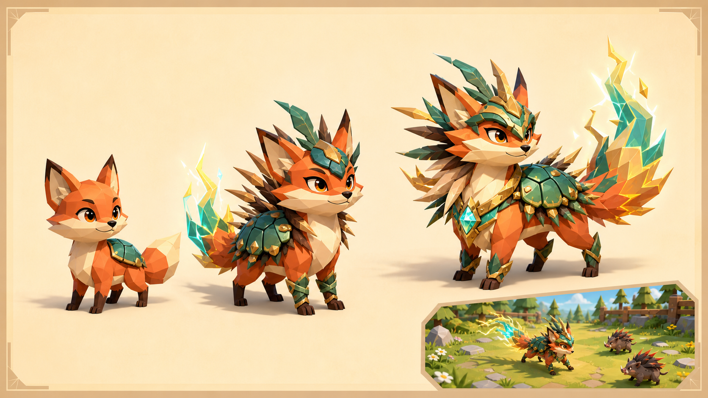
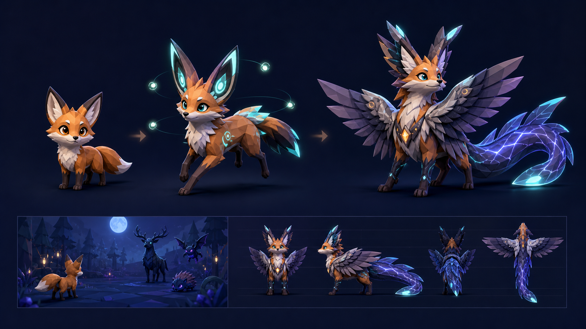
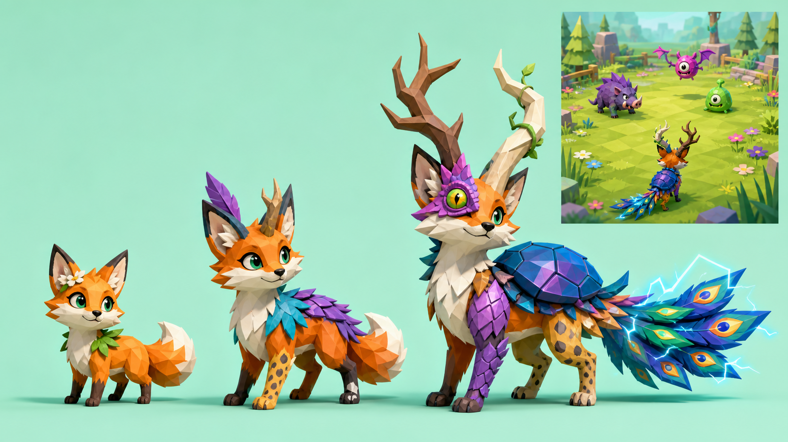

# Gate 0 Owner Choice

## Decision

**Selected:** A — Storybook Wildguard  
**Locked:** 2026-07-10

This completes owner contribution 2 of 4.

## A — Storybook Wildguard

## B — Moonlit Menagerie

## C — Curious Chimera

Boards B and C remain archived as research references, not blended defaults.

## First hero trio

The audited CC0 pack contains alpaca, bull, cow, deer, donkey, fox, two horses,
husky, Shiba Inu, stag, and wolf. Fox is the recommended first technical chassis.

**Selected trio:**

- Fox — **Greg** — proper older British gentleman.
- Bull — **Benny** — nervous that others see him as big and clumsy.
- Alpaca — **Gracie** — twee matcha-loving trend follower who avoids anything
  that becomes too trendy.

This completes owner contribution 1 of 4. Detailed implementation guidance is in
[`hero-briefs.md`](hero-briefs.md).
