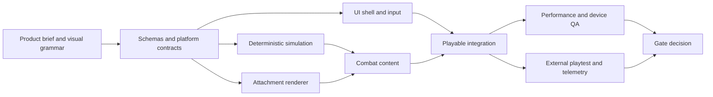

# Animal Survivor: Greenlight Study and Swarm Build Plan

**Status:** Conditional zero-cash hobby prototype greenlight  
**Research current through:** 2026-07-09  
**Working title:** Project Wildform (placeholder only)  
**Primary launch hypothesis:** Free web build first; no paid platform work before validation

### Owner constraints locked on 2026-07-09

- Serious hobby project, not a business obligation.
- No cash budget beyond existing $20/month Claude and $20/month GPT plans.
- Low-poly 3D presentation.
- Original art must come from CC0/open assets, procedural kitbashing, AI-assisted
  concepts/textures, and at most five small owner-created contributions.
- Movement-only combat with automatic targeting and attacks; depth comes from
  drafting, positioning, attachment placement, recipes, and evolutions.
- Heroes begin cute and heroic, then grow increasingly strange and mutated while
  remaining recognizable.
- No runtime AI service, paid API, paid asset, paid backend, contractor, or store
  membership is assumed by this plan.
- All production labor is performed by AI agents. The owner is the creative
  director/approver and is not expected to code, create assets, run tests, or
  maintain files. Available model usage is the operative project budget.

## 1. Executive decision

This idea is worth prototyping, but the generic pitch is not worth building.

“Vampire Survivors with cute animals” is already crowded. Direct examples include
FuwaFuwa Survivors, Pets Survivors, Mayhem Survivors: Animals, Animal Survivors,
Feisty Fauna, and Supercat Survivors. Most of the small, theme-led entries have
very little review traction. Animal art by itself is not a defensible hook.

The stronger idea is worth testing:

> A bullet-heaven roguelite where the animal's body is the loadout. Every
> meaningful upgrade occupies a visible body socket, changes combat, and can
> evolve into a dramatic new form. At the end of a run, the player's recognizable
> animal has become a unique, shareable legend.

That promise has demand. *Everything is Crab* is the closest competitive threat:
it offers more than 125 visible animal evolutions and reportedly passed 500,000
sales shortly after its May 2026 launch. It proves players want visually evolving
animals, but it also removes any room for a vague “animal mutations” pitch.

The project should proceed only if a four-to-six-week prototype proves all three
of these claims:

1. Players choose upgrades partly because they are excited to see the animal
   change, not only because a number is larger.
2. A completed build remains readable and attractive during dense combat.
3. The same attachment framework can produce enough variety without requiring
   unique art for every hero-item combination.

**Recommendation:** spend time—not money—on the prototype gates. Do not build a
large roster, multiplayer, live operations, native iOS packaging, or commercial
store integrations unless the hobby prototype becomes unusually compelling.

## 2. Competitive landscape

### Direct and near-direct competitors

| Game | What overlaps | Current signal | Lesson for this project |
| --- | --- | --- | --- |
| [Everything is Crab](https://store.steampowered.com/app/3526710/Everything_is_Crab/) | Animal evolution, visible body parts, roguelite builds | Steam shows thousands of reviews; [500,000 sales reported in June 2026](https://www.pcgamer.com/games/roguelike/my-favourite-new-roguelike-is-all-about-evolution-and-crabs-and-its-celebrating-500k-sales-with-a-big-update/) | Strong validation and strongest threat. We need persistent named heroes, socket-readable bullet-heaven builds, and authored attachment evolution rather than mutation soup. |
| [Temtem: Swarm](https://store.steampowered.com/app/2510960/Temtem_Swarm/) | Creature heroes, evolution, survivor-like combat, co-op | More than 1,900 reviews on the checked Steam page, 80% positive | Creature IP and co-op are strong, but its species evolution is authored rather than a player-built visible body. Do not compete on roster size. |
| [FuwaFuwa Survivors](https://store.steampowered.com/app/4043830/FuwaFuwa_Survivors/) | 3D animal heroes, 15-minute runs, skill evolution, pets/taming | Very low review count at time of research | “Cute animals + many synergies” does not create discovery by itself. |
| [Wildkeepers Rising](https://store.steampowered.com/app/2995560/Wildkeepers_Rising/) | Bullet heaven plus creature collecting/taming | 103 reviews, 79% positive on checked page | Creature collection is occupied territory; the hero's physical loadout must be the star. |
| [Pets Survivors](https://store.steampowered.com/app/4315670/Pets_Survivors/) | Pet heroes and standard survivor progression | 12 reviews on checked page | A literal genre reskin is not enough. |
| [Mayhem Survivors: Animals](https://store.steampowered.com/app/2539180/Mayhem_Survivors_Animals/) | Animals, 23+ weapons, 55+ items, 250+ choices | 32 reviews on checked page | Content-count claims do not replace a memorable product fantasy. |
| [Feisty Fauna](https://store.steampowered.com/app/1916560/Feisty_Fauna/) | Animal heroes, bullet heaven, story, local co-op | Coming soon when checked | Watch its demo and positioning; do not add co-op merely to match it. |
| [Brotato](https://store.steampowered.com/app/1942280/Brotato/) | Readable carried weapons and compact builds | Overwhelmingly positive at very large review scale | Visible loadouts work. Our opportunity is to make the entire silhouette communicate the build. |
| [Bio Prototype](https://store.steampowered.com/app/3689520/Bioprototype/) | Modular organ chains and emergent synergies | Deep system, modest current listing traction | System depth without immediately charming feedback is not sufficient. |
| [TerraTech Legion](https://store.steampowered.com/app/3596700/TerraTech_Legion/) | Survivor-like in which upgrades physically attach to the avatar | Launched April 2026 | Spatially attached upgrades can differentiate the genre, but excessive build friction can fight the flow-state fantasy. |

### Market conclusion

The genre is saturated at the concept level and still open at the experience
level. Successful entries do not win by adding more cards; they win by adding a
one-sentence mechanic that changes what the player sees or decides every minute.

This project's defensible combination is:

- persistent, emotionally recognizable animal heroes;
- a body-as-loadout system with mechanically relevant sockets;
- authored, surprising animal-trait evolutions;
- a high-density bullet-heaven loop rather than an ecosystem survival sim;
- a saved/shareable final form that turns each run into user-generated marketing.

## 3. Product definition

### One-sentence pitch

Build an adorable animal into an absurd combat chimera—every power attaches to
its body, every evolution changes its silhouette, and every run ends with a hero
worth saving and sharing.

### Design pillars

1. **The build is the body.** If an upgrade materially affects play, the player
   can locate its effect on or around the animal without opening a stat panel.
2. **Animal verbs, not animal skins.** Pounce, burrow, glide, molt, bristle,
   echolocate, stampede, spray, coil, and regenerate should create mechanics that
   would feel wrong on a generic wizard.
3. **Recognizable at both ends.** A fox must still read as that specific fox at
   minute fifteen, even after gaining owl wings, beetle armor, and an electric
   eel tail.
4. **Readable chaos.** Enemy danger, pickup value, and the hero silhouette remain
   legible when the screen is full. Player effects never conceal lethal tells.
5. **A run leaves a souvenir.** The final portrait, generated build name, seed,
   stats, and evolution tree are saved to a “Field Guide” and can become a share
   card.

### Audience and tone

- Primary: players who enjoy Vampire Survivors, Brotato, Pokémon-like creatures,
  and buildcraft but want a brighter, character-led presentation.
- Secondary: cozy/wholesome players who normally avoid grim action games but
  enjoy collection, transformation, and completion.
- Tone: charming nature-documentary absurdity, not babyish and not biologically
  grotesque. “Majestic little disaster” is the target feeling.
- Rating target: family-friendly fantasy combat with no gore; portal and mobile
  friendly.

## 4. The core game

### Run loop

1. Choose a named animal hero and one starting instinct.
2. Enter a 12-to-15-minute biome.
3. Move with one stick. Targeting, attacks, and species instincts trigger
   automatically; there is no aim or ability button.
4. Defeat swarms, collect XP/food, and choose one of three adaptations.
5. Attach the adaptation to a legal body socket. Placement determines attack
   direction or tactical behavior, but placement takes only a few seconds.
6. Level an attachment or combine two compatible traits to evolve it.
7. Defeat biome events, elites, and the apex boss.
8. Save the final form to the Field Guide, earn unlock currency, and start a new
   run with a newly discovered trait, hero, or challenge—not a flat stat grind.

### Body-as-loadout model

The animal has a small number of meaningful sockets:

| Socket | Typical mechanical role | Visual examples |
| --- | --- | --- |
| Head | Forward attacks, targeting, critical effects | antlers, chameleon eyes, ram helm, sonar ears |
| Back | Area control, launchers, defense | porcupine quills, beetle shell, frog egg pods |
| Forelimbs | Short-range and alternating attacks | mantis claws, mole gauntlets, crab pincers |
| Hindlimbs | Movement, trails, stomp effects | hare springs, gecko pads, kangaroo kick |
| Tail | Rear coverage, sweeping, stored charge | eel coil, scorpion stinger, peacock fan |
| Aura/Companion | Orbitals, herd effects, support | fireflies, remora, ducklings, oxpecker |

Sockets are not a slow inventory puzzle. A level-up card previews the attachment
on the live hero, highlights legal sockets, and auto-places after a short timeout.
Advanced players may move or replace a part at rare safe points.

Each attachment has three visible states:

- **Bud:** first acquisition; a clear but compact silhouette change.
- **Adapted:** level milestone; stronger animation, color, or scale.
- **Mythic evolution:** a paired recipe that changes both mechanics and form.

Numeric levels between visual milestones can add polish or small VFX, but should
not add clutter. “Every upgrade is visible” means every distinct system/part is
visible; it does not require a new mesh or sprite for every +5% increment.

### Evolution examples

| Base trait | Catalyst | Evolution | Result |
| --- | --- | --- | --- |
| Porcupine Quills | Pufferfish Lung | **Thornstorm Mantle** | Back quills inhale, expand, then fire a radial volley; retained quills block one hit. |
| Electric Eel Tail | Firefly Colony | **Thunderbug Dynamo** | Tail stores movement charge while orbiting fireflies chain lightning to marked enemies. |
| Chameleon Tongue | Frog Toes | **Bogshot Grappler** | Tongue pulls elites into a splash zone; toe pads leave slowing lily patches. |
| Owl Wings | Bat Ears | **Midnight Radar** | Wing beats emit rotating sonar cones that expose weak points and redirect homing feathers. |
| Beetle Shell | Armadillo Roll | **Meteor Carapace** | The hero curls during dash, becomes briefly invulnerable, and lands in a knockback crater. |
| Skunk Gland | Monarch Dust | **Royal Stinkcloud** | A colorful toxic trail charms weak enemies before bursting into butterflies. |

### Launch-scope hero strategy

Do not begin with ten unrelated body plans. Art combinatorics will sink the
project. Use three shared chassis families and make personality come from head,
tail, palette, animation, and starting verb.

The founding trio is locked:

- **Greg the fox — Pouncer:** proper older British gentleman; mobile, precise,
  and rewarded for near-misses.
- **Benny the bull — Bastion:** gentle and nervous about seeming big or clumsy;
  defensive reactions become protective shockwaves.
- **Gracie the alpaca — Surveyor:** matcha-loving twee trend curator; orbitals,
  marks, awareness, and controlled support.

Gate 1 uses only one readily available animated animal. Gate 3 introduces the
other two body plans. If attachments cannot remain coherent across all three,
the content pipeline is not ready for expansion.

### Meta progression

Favor horizontal discovery over permanent damage inflation:

- unlock traits by performing animal-like feats;
- rescue/recruit named heroes;
- discover evolution recipes, then choose whether recipes remain secret or show
  as hints in future runs;
- fill the Field Guide with final forms and ecology notes;
- unlock challenge modifiers, palettes, habitats, and starting instincts;
- keep modest accessibility assists separate from prestige difficulty.

Avoid energy systems, gacha, multiple currencies, equipment rarity treadmills,
and daily chores in the first commercial version.

## 5. Art and presentation strategy

### Recommended production style

Use **stylized low-poly 3D with modular mesh attachments** for the prototype.
This is an owner decision, not an open question.

Why:

- 3D attachments can be parented to named bones or sockets and remain correct as
  the hero turns in any direction;
- flat-shaded geometry and shared palette materials keep models small;
- existing CC0 rigged animals provide a legal prototype base;
- simple primitives can become horns, shells, glands, quills, wings, and tails
  without requiring a professional sculptor;
- the growing silhouette is easier to appreciate in a gently angled orthographic
  camera than in top-down 2D.

The cost is performance and pipeline complexity. Use one directional light, no
realtime shadows on swarm units, no fur, no physics-driven accessories, no
high-resolution texture sets, and no unique skeletal animation for attachments.
Attachments follow sockets rigidly or use tiny procedural motions. The prototype
starts with one proven CC0 animal rig before attempting additional body plans.

### Zero-budget asset pipeline

1. Start with [Quaternius' Ultimate Animated Animal Pack](https://quaternius.com/packs/ultimateanimatedanimals.html),
   which provides 12 animated animals in glTF/Blend and is CC0. Its smaller
   [animated animal pack](https://quaternius.itch.io/lowpoly-animated-animals)
   is also CC0 and includes idle, walk, run, jump, and death animations.
2. Use [Quaternius' Ultimate Nature Pack](https://quaternius.com/packs/ultimatenature.html)
   and [Kenney assets](https://kenney.nl/assets) for CC0 environments, props, UI,
   and placeholders. Kenney confirms that assets on its asset pages are CC0.
3. Standardize runtime models as optimized `.glb`: shared palette material,
   compressed textures only when necessary, named sockets, normalized scale, and
   a small animation set.
4. Build mutations by kitbashing CC0 meshes and Blender primitives. Prefer
   geometry plus flat colors over AI-generated texture detail.
5. Use image generation for concept sheets, evolution cards, mood boards, icons,
   and portrait references. Treat generated images as design inputs; a generated
   picture is not automatically a rigged, optimized, game-ready 3D model.
6. Keep `assets/ASSET_LEDGER.md` with source URL, author, exact license, download
   date, modifications, and the repository path of every imported asset. Prefer
   CC0; do not import an asset whose license is unclear.

### Owner's personal touch: four contributions maximum

The owner should be asked for only these four high-leverage contributions:

1. **Complete:** Greg the fox, Benny the bull, and Gracie the alpaca.
2. **Complete:** Storybook Wildguard visual direction.
3. Select one mascot signature feature from AI-generated options.
4. Name five favorite mythic evolutions after seeing playable prototypes.

Everything else should be handled through open assets, procedural tools, AI
concept generation, and implementation agents unless the owner volunteers more.

### Visual rules

- One dominant, one supporting, and one accent attachment may alter the outer
  silhouette; minor passives use texture, aura, companion, or animation channels.
- Player attacks share a saturated friendly palette; enemy attacks use a distinct
  danger palette and shape language.
- Fully built heroes must still show the eyes, face direction, hurt state, and
  ground contact.
- Attachments cannot overlap critical anatomy or each other at legal anchors.
- Every combination is tested at gameplay scale, not only in the dressing room.
- End-run portraits may use higher-resolution art and richer effects than combat.

## 6. Platform and business decision

### Recommendation: web first, iOS second

A browser link maximizes learning per dollar. It removes install friction, allows
instant updates, makes playtests easy to recruit, and can reach portal audiences.
[CrazyGames says it reaches more than 50 million users](https://developer.crazygames.com/),
while [itch.io allows creator-selected revenue share](https://itch.io/docs/creators/payments).
A self-hosted site alone has almost no discovery, so “web first” means:

1. self-hosted/PWA build for direct tests and sharing;
2. itch.io page for community builds and a potential supporter edition;
3. portal-safe build for CrazyGames after the loop is polished;
4. Steam-native packaging or a native-engine build if commercial PC demand is
   demonstrated by wishlists and demo response.

Portal constraints shape the product. CrazyGames' current guidance says strong
games often load in under ten seconds, stay under 20 MB for the initial experience,
and achieve 10–15% Day-1 retention. Its hard initial download limit is 50 MB, or
20 MB for mobile-homepage eligibility. Poki recommends roughly 8–10 MB total and
identifies web-native engines such as PlayCanvas and Phaser as stronger fits than
large native-first exports.

### Why not iOS first

iOS offers a large games audience, trusted payments, Game Center, TestFlight, and
strong re-engagement, but it adds App Review, privacy disclosures, platform SDK
work, annual membership, and store economics before the core loop is proven.
Apple currently lists a $99/year developer membership and a 15% paid-app/IAP rate
for qualifying Small Business Program developers. A thin website wrapper also
risks the App Store's minimum-functionality rule.

iOS is parked because the current budget cannot cover the Apple membership. It
should be reconsidered only if the owner later chooses to fund it or the web build
earns enough to cover itself. The iOS
edition should bundle assets for offline play and add native value: Game Center,
haptics, controller glyphs, safe-area layouts, reliable suspend/resume, and
StoreKit full unlock. Recommended business model: $4.99–$7.99 premium, or a free
demo with one permanent full-game unlock. Do not start with ad-heavy free-to-play.

### Zero-budget release sequence

- Prototype: none.
- Direct build: free static-hosted PWA and free itch.io build.
- Portal validation: submit only after the hook works. If a portal accepts the
  game, ads may appear only at natural run boundaries. Never interrupt combat and
  never paywall visual evolution.
- Optional support: an itch.io donation/pay-what-you-want setting may fund future
  store fees, but the game remains fully playable for free.
- Steam and iOS are future options, not current milestones.

## 7. Technical architecture

### Recommended stack for the low-poly web build

- **Language:** TypeScript with strict compiler settings.
- **Renderer/input:** the standalone PlayCanvas Engine from npm. It is MIT
  licensed, provides TypeScript declarations, imports glTF/GLB, and supports
  WebGL 2 with WebGPU where available.
- **Build:** Vite.
- **Simulation:** renderer-independent fixed-timestep core using seeded RNG,
  pooled entities, flat/typed data where profiling justifies it, and a spatial
  hash for queries.
- **3D pipeline:** Blender to GLB, orthographic camera, shared flat-shaded palette
  materials, named bone/socket nodes, static batching, and hardware instancing
  for swarm units, projectiles, pickups, and repeated scenery.
- **Validation:** schema-validated content definitions and deterministic replay
  tests.
- **Testing:** Vitest for logic/content, Playwright for browser smoke tests, and a
  real-device performance harness.
- **Delivery:** PWA shell and a platform-adapter layer for storage, telemetry,
  portal ads, cloud save, sharing, and later Capacitor/iOS integrations.

Why PlayCanvas rather than Phaser or Godot: Phaser is an excellent 2D choice but
does not fit the chosen low-poly 3D direction. Godot would make later native
packaging easier, but its web build has a larger baseline and more portal caveats.
PlayCanvas is web-native, open source, available without its cloud editor, and its
hardware-instancing path is explicitly intended for large groups such as bullets,
trees, and repeated geometry. WebGL 2 remains the required baseline; WebGPU is an
optional enhancement, never a requirement.

### Repository shape

```text
/
  apps/web/                 PlayCanvas composition root, camera, input, PWA shell
  packages/core/            deterministic simulation and seeded RNG
  packages/content/         heroes, traits, evolutions, enemies, waves
  packages/attachments/     3D sockets, GLB assembly, previews, validators
  packages/platform/        storage/telemetry/ads/share adapter interfaces
  packages/ui/              HUD and menu components
  assets/source/            editable source assets
  assets/generated/         atlases and optimized runtime assets
  tools/                    validators, atlas build, balance simulation
  tests/replays/            deterministic golden-run fixtures
  docs/                     decisions, contracts, content bible, test plans
```

### Core contracts to freeze before swarm expansion

```ts
type Socket = "head" | "back" | "forelimb" | "hindlimb" | "tail" | "aura";

interface AttachmentDefinition {
  id: string;
  socket: Socket;
  tags: string[];
  visualStages: readonly [string, string, string];
  compatibleChassis: string[];
  behaviorId: string;
  evolutionRecipes: string[];
}

interface PlatformAdapter {
  loadSave(): Promise<unknown>;
  writeSave(data: unknown): Promise<void>;
  emit(event: TelemetryEvent): void;
  shareRun(card: ShareCard): Promise<void>;
  showBoundaryAd?(placement: string): Promise<void>;
}
```

Content files reference behavior IDs; they do not contain executable scripts.
All content IDs are stable and globally unique. Saves and telemetry are versioned
from the first playable build.

### Performance budgets

The prototype is not accepted because it “feels fine” on a development laptop.

| Target | Budget |
| --- | --- |
| Desktop Chrome/Firefox on a mid-range laptop | 60 FPS at 750 low-poly enemies, 250 player projectiles, 150 pickups |
| Mobile Safari on an agreed mid-tier test device | 30 FPS at 350 low-poly enemies, 100 player projectiles, 75 pickups |
| Gameplay-start download | Goal under 20 MB; hard ceiling 50 MB |
| Time to interactive on normal broadband | Under 10 seconds |
| Main-thread long tasks during steady combat | None over 100 ms; p95 frame time tracked continuously |
| Suspend/resume | No lost run or duplicate rewards after backgrounding |

Implementation rules:

- no general-purpose physics engine for swarm movement or projectile collision;
- repeated enemies and projectiles render through hardware instancing rather than
  one scene entity and animation rig per unit;
- object pools for enemies, projectiles, pickups, damage numbers, and particles;
- spatial grid queries rather than all-pairs checks;
- capped particles, damage numbers, corpses, and audio voices;
- GLB mesh compression where supported, shared materials, low bone counts,
  compressed textures, and staged asset loading;
- adaptive enemy render count and effects quality without altering simulation
  fairness;
- profiling captures committed alongside performance-sensitive changes.

## 8. Validation roadmap and gates

### Gate 0 — Concept, license, and art test

Deliver:

- three mock before/after heroes;
- one 15-second fake gameplay clip or animated mockup;
- twelve attachment cards and six evolution pairings;
- an audited shortlist of CC0 animated animal and environment assets;
- the initial `assets/ASSET_LEDGER.md`;
- a one-page landing test with two alternative pitches;
- five competitor teardown notes, including Everything is Crab and one failed or
  low-traction animal survivor.

Pass if target players can repeat the pitch without prompting and at least 60% of
ten qualitative testers prefer choosing a visible adaptation over a functionally
equivalent invisible stat card.

### Gate 1 — Technical toy

Deliver:

- one audited CC0 animated animal chassis chosen for pipeline reliability;
- six live attachments across four sockets;
- one enemy type and a five-minute escalating swarm;
- movement, auto-attack, XP, three-choice level-up, death/restart;
- performance overlay and deterministic seed;
- browser deployment with keyboard and touch.

Pass if the budgets above are plausible and arbitrary legal attachment
combinations do not visibly break.

### Gate 2 — Hook prototype

Deliver:

- one 10-minute run;
- twelve attachments, six evolved forms, four enemy roles, two elites, one boss;
- live attachment preview and quick socket placement;
- end-run portrait/share card and local Field Guide;
- minimal telemetry and 30–50 external playtesters.

Greenlight the vertical slice only if:

- tutorial completion is at least 70%;
- at least 35% immediately begin a second run;
- median first session is at least 12 minutes;
- at least 50% mention transformation/appearance unprompted as a reason to play;
- at least 70% can correctly identify three equipped systems from the final
  silhouette;
- fewer than 10% report that attachments made danger unreadable;
- no crash/session-loss issue affects more than 1% of runs.

### Gate 3 — Vertical slice

Deliver:

- three owner-named heroes filling Pouncer, Bastion, and Surveyor roles;
- one polished biome with a 15-minute arc;
- 18 base attachments, 12 mythic evolutions, 8 enemy roles, 3 elites, 1 apex boss;
- Field Guide, unlock challenges, settings, accessibility, save migration;
- portal integration behind an adapter;
- closed test of 200+ qualified players.

Expanded hobby-build greenlight:

- Day-1 retention at least 20% on qualified/direct traffic; 10–20% is iterate,
  below 10% is a stop/pivot after two meaningful revisions;
- second-run rate at least 35%;
- at least 5% use the save/share-card action without an external reward;
- performance and load budgets hold on the device matrix;
- content team can take one attachment from concept to three tested visual stages
  across all three chassis in no more than two person-days after source art exists;
- at least 30% of testers say they would buy at the proposed price.

### Kill or pivot conditions

Stop scaling content if any remains true after two focused iterations:

- players evaluate parts only as stats and ignore the visual preview;
- final forms look random, cluttered, or interchangeable;
- one new hero multiplies attachment-art work nearly linearly;
- the browser cannot maintain the minimum mobile target without removing the
  swarm fantasy;
- test retention remains below portal norms;
- the design drifts into a slower inventory builder that interrupts the
  move-dodge-destroy rhythm.

Possible pivots are a compact web game, a dressing/build sandbox with
short combat trials, or a single-animal deep evolution game. Do not conceal a
failed hook by adding more currencies or content.

## 9. Production scope after greenlight

Target a deliberately small free hobby 1.0:

- 4 heroes across no more than 3 chassis families;
- 2 biomes, each with a distinct tactical rule and apex boss;
- 24 base attachments and 18 mythic evolutions, with combinatorial tags and
  branching recipes providing depth without hundreds of assets;
- 15-minute standard runs plus a 7-minute quick mode;
- 12 enemy roles reskinned/modified thoughtfully across biomes;
- 12–18 hours for broad unlock completion, with replayability from builds and
  challenges rather than mandatory grind;
- no online multiplayer in 1.0;
- optional local co-op considered only after single-player performance and
  readability are complete.

There is no responsible calendar promise because model availability and usage
limits are the production bottleneck. Progress is measured by accepted milestones
and resumable checkpoints, not owner hours. Scope should shrink before the owner
spends money. AI agents perform implementation and tooling, but automated work
still requires explicit creative direction, asset-license review, real player
feedback, device QA, and evidence-based acceptance.

The project must remain buildable with free local tools and free static hosting.
The existing chat subscriptions are useful development assistance, but the game
must not assume that they include API credits or permit automated runtime calls.

## 10. Agent-swarm operating plan

### Rules of engagement

1. One lead/orchestrator owns the milestone, dependency graph, integration, and
   final acceptance. Agents do not invent new product scope.
2. Contracts and schemas are merged before parallel feature work begins.
3. Each task owns explicit directories. Two agents do not edit the same file in
   parallel.
4. Every task brief includes inputs, outputs, non-goals, acceptance tests, and
   performance impact.
5. Gameplay behavior is data-driven, but content data cannot execute arbitrary
   code.
6. New dependencies require a short decision record and bundle-size check.
7. A change is not complete until tests, docs, and a playable verification path
   exist.
8. Generated placeholder assets are labeled and tracked; shipping rights and
   final human art approval are mandatory.
9. The swarm never tunes solely from simulations. A human playtest owner makes
   balance calls using telemetry plus observed play.
10. Merge at least daily and keep the main branch deployable.

### Agent roles

| Agent | Owns | First deliverable |
| --- | --- | --- |
| Lead/integration | architecture, contracts, milestone board, code review, deploy | repo scaffold, CI, decision records, composition root |
| Simulation | fixed loop, entities, collisions, RNG, waves, damage | deterministic five-minute swarm benchmark |
| Attachment/rendering | bone/socket anchors, GLB assembly, previews, material and silhouette rules | one animated animal with six legal attachments and combination validator |
| Combat/content | traits, behaviors, evolutions, enemies, boss scripting | twelve data-defined traits and six recipes |
| UI/UX | HUD, level-up flow, socket placement, Field Guide, settings | playable onboarding and upgrade preview |
| Platform/performance | input, PWA, saves, telemetry, portal adapters, profiling | deployable web build and device benchmark dashboard |
| QA/test | automated tests, replay fixtures, device matrix, bug triage | smoke suite, deterministic golden run, release checklist |
| Asset/pipeline | CC0 sourcing, Blender normalization, GLB export, license ledger, procedural attachments | one legal animated animal plus six socketed mutations |
| Creative direction (owner + AI-assisted) | visual bible, character appeal, effects readability, tone | owner-approved direction board, mascot feature, and attachment grammar |
| Product/playtest (human-led) | recruiting, interviews, metrics, go/no-go calls | Gate 0 script and Gate 2 report template |

### Dependency order



### Initial swarm backlog

**Epic A — Foundation**

- A1: scaffold TypeScript/Vite/PlayCanvas monorepo with lint, typecheck, tests, and
  production bundle report;
- A2: define stable IDs, content schemas, save version, telemetry envelope, and
  platform adapters;
- A3: implement seeded RNG, fixed timestep, pause/resume, and replay recording;
- A4: add CI that builds, tests, runs a browser smoke test, and publishes a preview.

**Epic B — Swarm combat**

- B1: pooled enemy/projectile/pickup lifecycle;
- B2: spatial grid collision queries and simple steering;
- B3: wave director with time-budgeted spawn curves;
- B4: damage, knockback, status, invulnerability, death, XP, and level-up pause;
- B5: deterministic benchmark scene with captured frame metrics.

**Epic C — Visible build system**

- C1: chassis anchor schema with socket, transform, mask, and depth band;
- C2: GLB attachment assembler with named bone/socket transforms;
- C3: legal-combination validator and screenshot matrix generator;
- C4: live card hover/touch preview on the hero;
- C5: three-stage visual evolution and recipe resolution;
- C6: final-form portrait renderer and share-card data contract.

**Epic D — Hook content**

- D1: first hero movement and automatic signature instinct;
- D2: twelve attachments using at least five animal verbs;
- D3: six cross-trait mythic evolutions;
- D4: four enemy roles, two elites, one apex boss;
- D5: ten-minute wave arc with at least three tactical phase changes.

**Epic E — Player experience**

- E1: keyboard, gamepad, and touch movement with automatic device prompts;
- E2: ten-second in-play onboarding;
- E3: HUD with health, XP, timer, boss tells, and attachment strip;
- E4: death/victory summary, restart, Field Guide save, and run history;
- E5: reduced flashes, screen shake slider, high-contrast danger, remapping, and
  readable text scaling.

**Epic F — Evidence**

- F1: telemetry events for load, tutorial, run start/end, upgrade offer/pick,
  socket, evolution, death cause, replay, share, FPS tier, and errors;
- F2: privacy-respecting anonymous session ID and consent/configuration layer;
- F3: playtest build, survey, interview script, and observation checklist;
- F4: automated Gate 2 dashboard and a written go/iterate/stop recommendation.

### Definition of done for every swarm task

- requested behavior works in the integrated browser build;
- unit or browser coverage exists for the highest-risk behavior;
- TypeScript typecheck, lint, tests, and production build pass;
- no unrelated files are changed;
- content IDs and save/replay compatibility are preserved or migrated;
- performance impact is measured when the task touches the hot loop or assets;
- keyboard and touch paths are both checked when UI/input changes;
- the task's acceptance evidence is linked in its handoff note.

## 11. Risks and mitigations

| Risk | Severity | Mitigation |
| --- | --- | --- |
| Art combinatorics explode | Critical | Three chassis maximum, strict sockets, screenshot matrix, shared visual stages, pipeline-time gate before roster growth |
| Too close to Everything is Crab | Critical | Persistent named heroes, bullet-heaven density, socket tactics, authored mythic pairs, Field Guide/share souvenir; never pitch as freeform animal evolution |
| Attachments obscure combat | High | silhouette budget, danger palette, VFX caps, opacity under threat, gameplay-scale visual QA |
| Web performance collapses late-run | High | benchmark in Gate 1, no general physics, pools/spatial grid, instancing, adaptive effects, hard entity budgets |
| Upgrade placement breaks flow | High | preview on card, one-tap legal socket, auto-place timeout, reposition only at rare safe events |
| Agent swarm creates inconsistent architecture | High | frozen contracts, directory ownership, daily integration, decision records, lead acceptance |
| Content is broad but shallow | High | small authored set with paired mechanical transformations; no content-count marketing until the loop retains |
| Mobile monetization distorts design | Medium | premium/full-unlock model, boundary-only portal ads, visual system never ad-gated |
| “Cute” reads as generic asset-pack art | High | human art director, distinctive shape language, animation personality, cohesive palette, original final assets |

## 12. Research sources

Primary/current references used for platform and implementation decisions:

- [Steamworks: Steam Direct fee](https://partner.steamgames.com/doc/gettingstarted/appfee)
- [Steamworks: Steam Next Fest](https://partner.steamgames.com/doc/marketing/upcoming_events/nextfest)
- [CrazyGames developer portal](https://developer.crazygames.com/)
- [CrazyGames technical requirements](https://docs.crazygames.com/requirements/technical/)
- [CrazyGames basic-launch metrics](https://docs.crazygames.com/resources/basic-launch-metrics/)
- [Poki web-engine guide](https://developers.poki.com/guide/web-game-engines)
- [itch.io payments and open revenue sharing](https://itch.io/docs/creators/payments)
- [PlayCanvas Engine documentation](https://developer.playcanvas.com/user-manual/engine/)
- [PlayCanvas hardware instancing](https://developer.playcanvas.com/user-manual/graphics/advanced-rendering/hardware-instancing/)
- [Quaternius Ultimate Animated Animal Pack, CC0](https://quaternius.com/packs/ultimateanimatedanimals.html)
- [Kenney asset licensing, CC0](https://kenney.nl/support)
- [Godot web export constraints](https://docs.godotengine.org/en/stable/tutorials/export/exporting_for_web.html)
- [Apple Developer Program](https://developer.apple.com/programs/)
- [Apple Small Business Program](https://developer.apple.com/app-store/small-business-program/)
- [Apple App Review Guidelines](https://developer.apple.com/app-store/review/guidelines/)
- [Apple TestFlight](https://developer.apple.com/testflight/)

## 13. Owner decisions and one remaining input

The owner has locked the project as a serious zero-cash hobby game, low-poly 3D,
automatic attacks and targeting, deep visible build evolution, and a cute-heroic
tone that becomes stranger and more mutated through each run. Open/CC0 and
AI-assisted art replace contractors. Personal owner work is capped by the four
contributions in Section 5. The first two are complete: the visual base is
Storybook Wildguard, and the founding heroes are Greg, Benny, and Gracie.

There is no owner-hours estimate. AI usage limits are the bottleneck, so milestone
scope—not calendar dates—is the source of truth. The checkpoint and continuation
policy is in [`ai-native-operating-model.md`](ai-native-operating-model.md).

## 14. Copy-paste swarm kickoff brief

Use this only after the owner answers Section 13 and explicitly authorizes Gate 0
and Gate 1:

> Build only the Gate 0 concept test and Gate 1 technical toy described in
> `docs/greenlight-and-swarm-plan.md`. The product hook is “the animal's body is
> the loadout.” Do not expand the roster, add multiplayer, add monetization, or
> begin commercial production. First freeze the TypeScript content, attachment,
> save, telemetry, and platform-adapter contracts. Then work in parallel with
> exclusive directory ownership: simulation, attachment rendering, UX/input,
> platform/performance, asset pipeline, and QA. Integrate daily into a deployable
> browser build. Use only assets recorded in `assets/ASSET_LEDGER.md`; prefer CC0
> and reject unclear licenses. Use the standalone PlayCanvas Engine, TypeScript,
> Vite, low-poly GLB assets, shared materials, and hardware instancing. The
> milestone is complete only when one audited CC0 animal supports six visible
> attachments, a
> deterministic five-minute swarm, keyboard and touch play, a live performance
> overlay, automated smoke tests, and a screenshot matrix of every legal visual
> combination. Report measured results against the Gate 1 budgets and recommend
> proceed, revise, or stop. Do not claim success from automated tests alone; the
> lead must perform and document a real browser playthrough.
